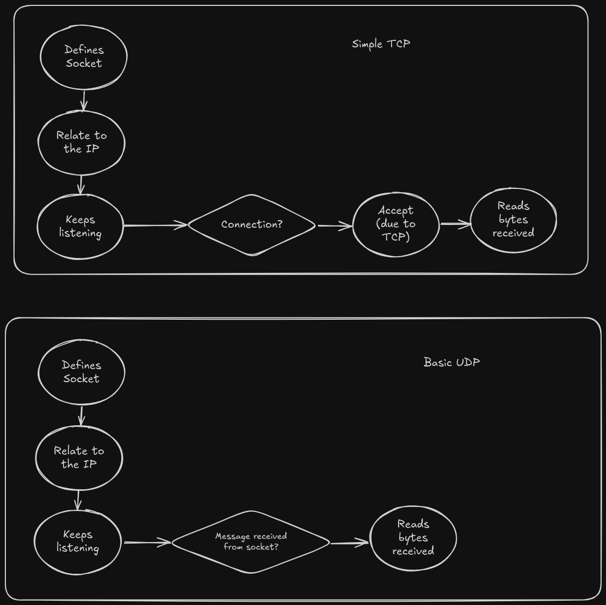

# Network Practice - Compilation & Execution

## Basic TCP

gcc basic_tcp/client.c -o output/client_tcp  
gcc basic_tcp/server_tcp.c -o output/server_tcp  

## Run the server and client
./output/server_tcp  
./output/client_tcp  

## Basic UDP

gcc basic_udp/client_udp.c -o output/client_udp  
gcc basic_udp/server_udp.c -o output/server_udp  

## Run the server and client
./output/server_udp  
./output/client_udp  

## TCP Using Structs

gcc tcp_and_struct/server_tcp_struct.c tcp_and_struct/common.c -o output/server_struct  
gcc tcp_and_struct/client_tcp_struct.c tcp_and_struct/common.c -o output/client_struct  

## Run the server and client
./output/server_struct  
./output/client_struct  

### TCP and UDP

